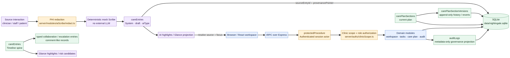

# Nightingale English — Technical Brief

**版本：** 2026-08-28  
**范围：** Phase 1–3 prototype implementation  
**数据边界：** synthetic data only

## 1. Architecture at a glance

Nightingale English is a TypeScript full-stack care-collaboration prototype. The browser renders role-specific workspaces and Timeline views through React. Requests cross a tRPC boundary into Node.js/Express procedures. Protected procedures resolve the session actor, clinic membership, and role before calling a domain module. Drizzle ORM maps the domain schema to a local SQLite file through `@libsql/client`; a deterministic seed creates the synthetic Foundation dataset.

The central architectural decision is to keep **clinical content, operational work, governance metadata, and AI provenance in one clinic-scoped relational model**, while keeping authorization at the server boundary. The frontend may hide or reveal affordances for usability, but it is never the source of truth for permission.



The runtime path is:

```text
Browser → Express/tRPC → protectedProcedure → clinic/role authorization → domain repository → SQLite
                                                    ↓
                                      PHI redaction → deterministic mock Scribe
```

The implementation is grounded in the repository’s product requirements for role-specific workspaces, source traceability, clinic scope, reviewable AI output, and explainable priority [1] [2].

## 2. Data model and provenance

The persisted model is deliberately compact. `careEntries` is the longitudinal spine: clinician, staff, patient, escalation, system, and AI entries share a common Timeline representation. `tasks` represents operational work and can point to a source entry. `carePlanSections` stores the current plan, while `carePlanSectionVersions` is append-only history for optimistic updates and reversions. `auditLogs` records governance actions without exposing raw clinical body text in the Admin drawer.

The requested conceptual entities map to the current implementation as follows:

| Concept | Current representation | Link and purpose |
|---|---|---|
| Entries | `careEntries` | Belongs to `clinics` and `patients`; has `authorUserId`, `authorRole`, visibility, review state and optional `sourceEntryId`. |
| Comments | Entry-like operational/escalation records and source-linked notes | The prototype does not maintain a separate `comments` table; comment-like collaboration is represented as typed entries or escalation/task content so it remains in the same Timeline/provenance path. |
| Versions | `carePlanSections` + `carePlanSectionVersions` | The current section points to the active version; each change appends a numbered version with `changedByUserId`, change type and optional `revertedFromVersion`. |
| Highlights | Glance View projections and AI extracted highlights | Highlights are derived presentation candidates, not a second source of truth. Each candidate retains its source entry or provenance pointer. |
| Provenance | `careEntries.sourceEntryId` + `provenancePointer` | AI entries use deterministic `session_id:<id>/source_entry_id:<id>` pointers; the frontend resolves the pointer to a Timeline entry and highlights it. |
| AI_Scribed_Notes | `careEntries` with `authorRole=System` and `aiType` | Three types are supported: doctor consultation, nurse consultation and patient session summaries. They start as review-required drafts. |
| Audit | `auditLogs` | Captures actor, role, action, target, timestamp and clinic scope for Admin governance; raw note/body fields are excluded from the read projection. |

The most important invariant is that an AI note is **not a new clinical truth**. It is a system-authored, review-required projection over a source interaction. The source remains addressable, and a reviewer can navigate from a highlight to the original Timeline entry. Patient-visible content is further constrained by visibility and role filters.

## 3. Request and authorization flow

Every protected tRPC operation first requires a session actor through `protectedProcedure` in `server/trpc.ts`. Domain authorization then applies the clinic scope functions in `server/authz/clinicScope.ts`. A request is accepted only when the actor identity, clinic membership, role, patient, source entry, task ownership, and state transition are consistent. Cross-clinic resources and role-incompatible operations fail with `403 Forbidden`.

The effective policy is deny-by-default at the resource boundary. Patient users are limited to their own patient workspace and patient-visible content. Staff users can read and update assigned operational tasks and create staff-originated escalations, but cannot perform clinician-only clinical review. Clinicians can review escalations and manage care-plan sections in their clinic. Admins can read clinic-scoped governance metadata, but the audit projection intentionally omits clinical note bodies and PHI. UI role selection is only a demonstration convenience; server checks enforce the actual boundary.

## 4. PHI redaction and AI Scribe path

The AI Scribe path is intentionally deterministic for local evaluation:

1. A source interaction is accepted only after clinic and role authorization.
2. `server/modules/aiScribe/redact.ts` applies strict server-side rules to mask supported names, phone numbers, and IC/ID numbers.
3. The redacted representation is passed to the local mock/fixture generator in `server/modules/aiScribe/service.ts`.
4. The generated note is persisted as a `System` entry with the appropriate visibility, `review_required` state, `aiType`, `sourceEntryId`, and deterministic `provenancePointer`.
5. The frontend displays the summary/highlights and uses the pointer to navigate back to the source Timeline entry.

No paid or remote model is required. There is no learning model in the runtime path. This is a deliberate safety and reproducibility choice: it eliminates API-key, network, latency, and model-version variability from evaluation. The redaction rules are a bounded prototype safeguard; they do not claim complete detection of all possible PHI.

## 5. Learning mechanism: current boundary and future extension

The current implementation does **not** train a model or adapt ranking weights online. Importance is a deterministic display projection based on clinical attention, role-specific action urgency, recency, severity/review state and source type, as described in the product requirements [1]. AI notes and human review states are auditable, but feedback is not silently converted into a clinical conclusion.

A future learning mechanism can integrate at the projection layer rather than the source-of-truth layer. Pin/accept/reject/edit/comment events could become clinic-scoped, auditable feedback signals, bounded to a small adjustment range and applied only to future ranking. It must not rewrite historical entries, bypass clinician authority, infer diagnosis, or cross clinic boundaries. This separation preserves deterministic clinical records while allowing explainable prioritization experiments.

## 6. Assumptions, first principles and trade-offs

**First principle — source before summary.** A summary is useful only when a reviewer can find the source, understand its status, and distinguish reported information from confirmed clinical judgement. That is why provenance is a first-class link and AI output begins as a draft.

**First principle — authorization before presentation.** Filtering in React is not security. The server checks session, membership, role and resource scope before repository access. This costs repeated policy code and tests, but it prevents a UI bug from becoming a data leak.

**Local SQLite over managed infrastructure.** SQLite is sufficient for a single-machine synthetic prototype and makes evaluation reproducible with no Docker or cloud account. It is not selected as a claim about production multi-writer scale; a production deployment would need a deliberate concurrency, backup, migration and operational review.

**Deterministic mock over external LLM.** Mock generation sacrifices linguistic breadth and model realism, but gains repeatability, zero API cost, offline operation, stable tests and a clear PHI boundary. The architecture leaves a future model adapter possible without making the evaluator depend on it.

**Shared entry spine over many specialized tables.** A single `careEntries` Timeline simplifies provenance and role filtering. The trade-off is that comment-like and AI-specific semantics are encoded as typed fields rather than fully normalized feature tables. For this scope, the simpler model improves traceability and reduces migration surface.

**Bounded scope.** Real-time presence, semantic merge proposals, automatic diagnosis, unrestricted adaptive learning, voice transcription, and production-grade PHI discovery are intentionally out of scope. The prototype optimizes for explainability, local reproducibility, and safe review boundaries rather than clinical completeness.

## References

[1]: https://github.com/WA0007UN-cell/Nightingale-English/blob/main/docs/PRD.md "Nightingale English Product Requirements Document"
[2]: https://github.com/WA0007UN-cell/Nightingale-English/blob/main/docs/Technical%20Architecture%20%E2%80%94%20Nightingale%20English%20%20V2.md "Nightingale English Technical Architecture V2"
[3]: https://github.com/WA0007UN-cell/Nightingale-English/blob/main/drizzle/schema.ts "Current Drizzle SQLite schema"
[4]: https://github.com/WA0007UN-cell/Nightingale-English/blob/main/server/authz/clinicScope.ts "Server-side clinic scope authorization"
[5]: https://github.com/WA0007UN-cell/Nightingale-English/blob/main/server/modules/aiScribe/redact.ts "Deterministic PHI redaction utility"
