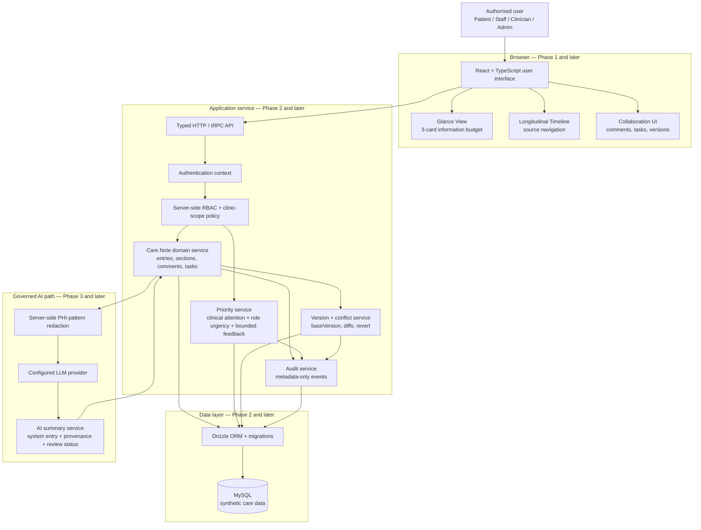
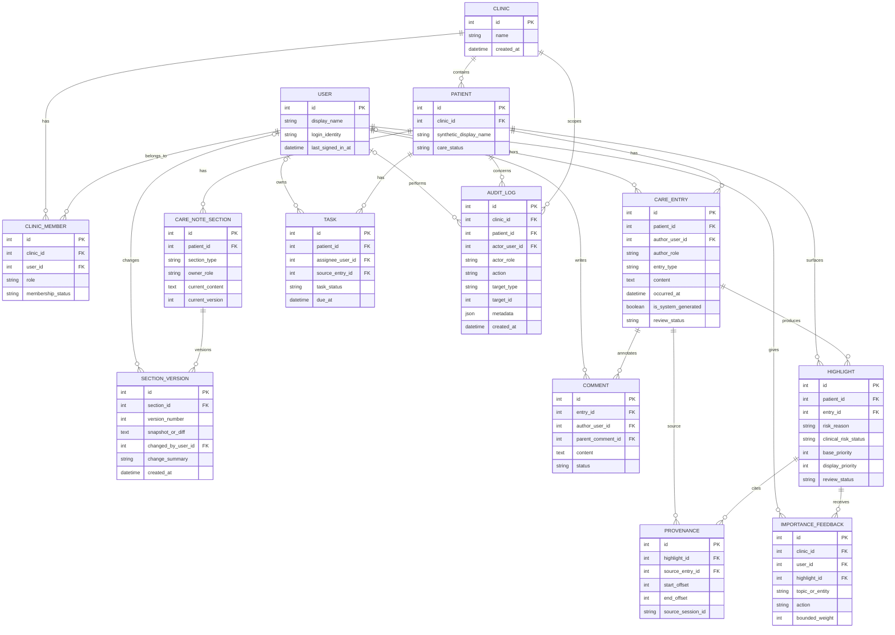
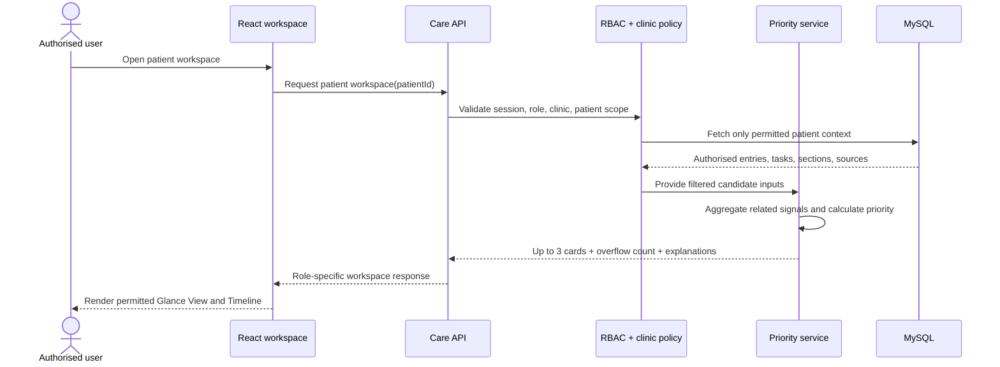
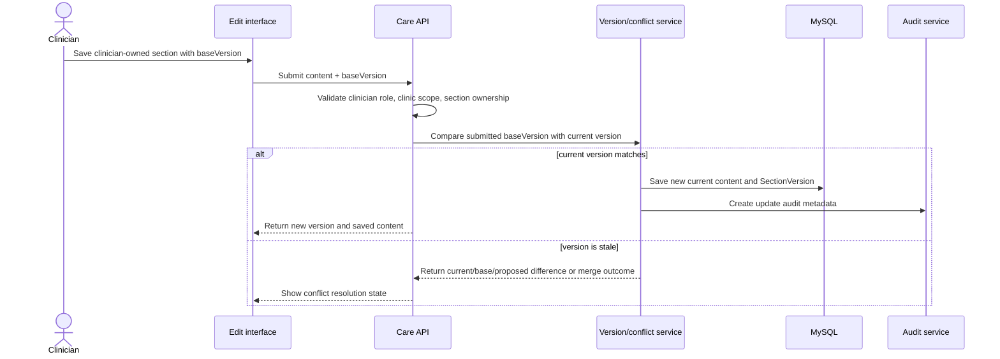
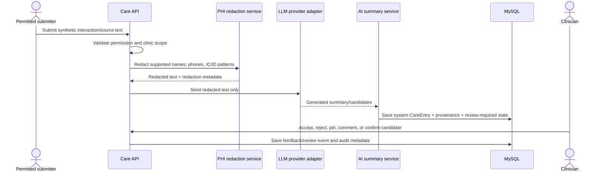
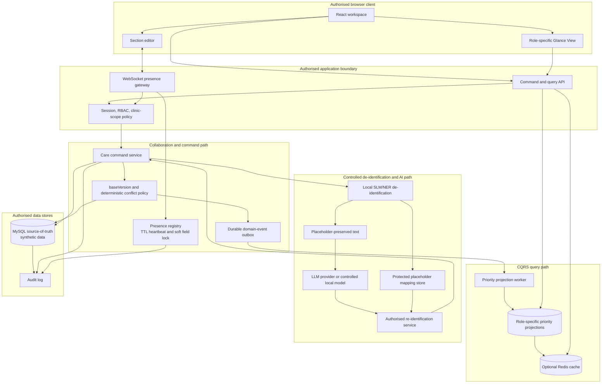
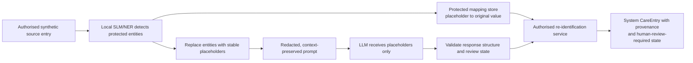

# Technical Architecture — Nightingale English

**Product:** Nightingale English — AI-Assisted Clinical Collaboration and Longitudinal Care Note Prototype  
**Version:** 0.1 — Architecture draft for review  
**Scope:** Conceptual target architecture for Phases 1–4; only synthetic data may be used.  
**Companion documents:** `PRD.md` defines product requirements; `ROADMAP.md` will define build order and completion criteria.

---

## 1. Architecture Purpose

Nightingale is designed as a small but trustworthy clinical-collaboration prototype. Its architecture must make four things explicit: **who is allowed to access each item, where a displayed statement came from, how a change is preserved, and how AI assistance stays reviewable rather than autonomous**.

The prototype starts with a fast English front-end demonstration in Phase 1. The intended target architecture then moves protected data, permission decisions, ranking, audit logging, and model calls to the server. The product must never claim that a visual role switcher alone is production RBAC.

> **Core architectural rule:** Authorise first, then retrieve only permitted data, then calculate ranking, then render a role-specific view.

---

## 2. Target System Architecture



### 2.1 Component Responsibilities

| Layer | Component | Responsibility | Must not do |
|---|---|---|---|
| Browser | React + TypeScript UI | Render the patient workspace, accept permitted user actions, and navigate to source evidence. | Decide final permissions, calculate sensitive ranking from unfiltered data, or send raw PHI to a model. |
| Browser | Glance View | Render at most three action cards plus an optional configured Critical banner and overflow route. | Become a compressed full record or expose raw score tables by default. |
| API | Typed API boundary | Validate request shapes and return only permitted, role-specific data. | Trust client-supplied role/clinic claims. |
| API | Authentication + RBAC | Build server-side user context; enforce role, clinic membership, ownership, and patient visibility rules. | Rely on hidden buttons as security. |
| Domain | Care Note service | Create/read entries, comments, protected care sections, and tasks. | Mutate protected content without permission and audit checks. |
| Domain | Priority service | Filter authorised candidates, aggregate related signals, calculate explainable priority, and allocate card slots. | Treat AI output as confirmed clinical truth or allow feedback to override Critical safeguards. |
| Domain | Version/conflict service | Store versions, compare `baseVersion`, create deterministic merge proposals, and perform safe revert. | Silently overwrite stale changes or auto-merge contradictory clinical facts. |
| Data | Drizzle + MySQL | Persist synthetic records, relationships, revisions, provenance, feedback, and audit metadata. | Store secrets in committed files or process real patient data. |
| AI | Redaction + summary service | Redact supported patterns before a model request; create system-authored, provenance-linked, unconfirmed entry. | Bypass human review, write an active clinical plan, or overwrite human-authored source text. |

### 2.2 Read and Write Paths

The normal **read path** begins with an authenticated request. The server determines current role and clinic membership, filters the patient record by that policy, generates permitted risk/task candidates, calculates display priority, and returns only the selected role-appropriate cards plus authorised timeline data.

The normal **write path** validates action input and permissions before mutation. Protected edits use a `baseVersion`; successful changes create a new version and metadata-only audit event. AI interactions add an additional prerequisite: supported PHI patterns are redacted on the server before any model call, and the resulting content is saved only as an unconfirmed system entry with provenance.

---

## 3. Architecture by Delivery Phase

| Phase | Architecture state | What is intentionally not claimed yet |
|---|---|---|
| **Phase 1** | React/TypeScript front end, local synthetic data, static explainable ranking, visual role switching, Glance View, Timeline, and source jump. | A visual role switcher is not server-enforced RBAC; local demo data is not persistent multi-user collaboration. |
| **Phase 2** | Express/Node API, MySQL in local Docker, Drizzle schema/migrations, server RBAC, clinic scope, comments/tasks, protected sections, versions, audit, base-version concurrency. | AI handling and adaptive feedback remain deferred. |
| **Phase 3** | Server redaction, configured LLM integration, separate AI summary types, provenance, human review, feedback events, automated validation, local latency measurement. | No autonomous diagnosis or production compliance claim. |
| **Phase 4** | Bounded adaptive ranking, Hot/Warm/Cold history policy, deterministic non-overlap merge and clinical conflict review. | Learning never overrides explicit safety floors or human clinical judgement. |

---

## 4. Conceptual Data Structure

### 4.1 Data-Model Principles

The model separates **the source record**, **the item displayed to draw attention**, **the collaborative action taken around it**, and **the immutable evidence that explains each decision**.

1. A `CareEntry` is the time-ordered source record. It may be a clinician note, staff note, patient update, system event, or AI-scribed note.
2. A `Highlight` is a derived, explainable candidate used by the Glance View. It never replaces the source entry.
3. `Provenance` resolves a highlight, AI entry, or other derived item back to a specific source record or source span.
4. A protected `CareNoteSection` stores current role-owned structured content; every revision creates a `SectionVersion`.
5. `ImportanceFeedback` stores a bounded, auditable user signal about a highlight/topic. It changes future ranking only; it never changes source facts.
6. `AuditLog` records who did what to which authorised target and when, using metadata only.

### 4.2 Conceptual Entity Relationship Diagram



### 4.3 Entity Responsibilities and Minimum Fields

| Entity | Why it exists | Key relationships | Important minimum fields |
|---|---|---|---|
| `User` | Represents a person who may sign in. | Joins clinics through `ClinicMember`; authors authorised changes. | `id`, display name, login identity. |
| `Clinic` | Defines the organisational access boundary. | Contains members and patients; scopes feedback/audit. | `id`, name. |
| `ClinicMember` | Defines a user’s role in one clinic. | Connects one `User` with one `Clinic`. | `userId`, `clinicId`, `role`, status. |
| `Patient` | Represents one synthetic patient record. | Belongs to one clinic; owns care context. | `id`, `clinicId`, synthetic name, care status. |
| `CareEntry` | Immutable-ish chronological source record. | Belongs to patient; may have comments/highlights/provenance. | author/system, author role, type, content, timestamp, AI/review state. |
| `CareNoteSection` | Current protected portion of the care note. | Has a history of section versions. | section type, owner role, current content, current version. |
| `SectionVersion` | Preserves a snapshot or deterministic diff for each protected change. | Belongs to section; records changer. | version number, snapshot/diff, change summary, actor, time. |
| `Comment` | Supports annotations, mention/escalation context, resolve state. | Attaches to source entry and optionally parent comment. | content, author, parent, status, mentioned IDs. |
| `Task` | Represents an operational follow-up action. | Belongs to patient; may link to entry and assignee. | status, assignee, due time, source entry. |
| `Highlight` | Derived priority candidate for Glance View. | Links patient and source entry; has provenance/feedback. | risk reason, risk state, scores, review status. |
| `Provenance` | Resolves a derived item back to source entry/span/session. | Links highlight/AI output to source. | source entry/session, start/end offsets. |
| `ImportanceFeedback` | Stores adaptive but bounded ranking feedback. | Scoped to clinic, user, highlight, topic/entity. | action, bounded weight, topic/entity. |
| `AuditLog` | Enables authorised inspection of important events. | Scoped to clinic/patient/actor/target. | action, target, actor role, metadata, time. |

### 4.4 Critical Relationship Rules

| Relationship/rule | Architectural decision |
|---|---|
| Clinic to patient | A patient belongs to exactly one clinic in the prototype, allowing clear scope checks. |
| User to clinic | A user may have membership/role in a clinic through `ClinicMember`; queries must verify this relationship. |
| AI-scribed note | AI content is not a separate untraceable blob. It is a `CareEntry` with `authorRole = system`, a distinct AI `entryType`, source/session provenance, and review state. |
| Highlight to source | Every source-derived highlight must point to permitted exact entry/span through `Provenance`. |
| Current care section to history | `CareNoteSection` holds current state; `SectionVersion` preserves change history. Revert creates a new version rather than deleting history. |
| Feedback to facts | Feedback is linked to highlight/topic, not used to rewrite care-entry source text. |
| Audit to content | Audit records event metadata, not an unbounded duplicate of raw note content. |

---

## 5. Data Classification and Trust States

| Data class | Example | Who may create it | Who may confirm/activate it | Required display treatment |
|---|---|---|---|---|
| Human clinical source | Clinician plan edit. | Authorised Clinician. | Authorised Clinician. | Human author/time; versioned and auditable. |
| Human operational source | Staff follow-up note/task. | Authorised Staff/Clinician. | Role-appropriate owner; not clinical confirmation by Staff. | Human author/time; task/assignment state. |
| Patient-provided source | Symptom update. | Patient or authorised Staff capture. | Clinician confirms clinical meaning when necessary. | Patient-reported label; no automatic diagnosis. |
| System/AI-derived source | AI consult summary/highlight. | System after server-side redaction. | Clinician for clinical confirmation. | System label, source/session provenance, review-required state. |
| Derived priority state | Glance View candidate score. | Priority service only. | Not a clinical fact; Clinician may act on source. | Explainable reasons; hidden raw factors by default. |
| Governance evidence | Audit event, version diff. | System. | Authorised inspector. | Metadata-only, scoped, and immutable in normal flow. |

---

## 6. Security and Privacy Boundaries

| Boundary | Required decision |
|---|---|
| Data set | All demo records, conversations, names, identifiers, and contact details are synthetic. |
| Authorisation | Server validates identity, role, clinic membership, ownership, and target patient scope for every protected read/write. |
| Patient access | Patient responses omit internal comments, internal Staff/Clinician notes, raw AI-scribed notes, internal risk queues, and other users’ data. |
| Section ownership | Staff cannot overwrite Clinician-owned care-plan sections; Clinicians do not silently overwrite protected Staff-authored source notes. |
| Model input | Server redacts supported names, IC/ID numbers, and phones before external/model processing. |
| Secrets/logging | Credentials live only in local environment configuration; do not commit `.env`; logs avoid raw PHI/secrets. |
| Transport/storage | Production design documents TLS in transit and encryption at rest. Local Docker is development-only. |

---

## 7. Open Technical Decisions for Implementation

| Decision | Current proposal | Reason to revisit |
|---|---|---|
| API format | TypeScript Express API, optionally tRPC for typed client/server calls. | Choose one clear route during Phase 2 scaffolding. |
| Version persistence | Store full snapshots first; optionally add deterministic diffs for concise UI later. | Snapshots are simpler to validate within challenge time. |
| Authentication | Demo-safe local role fixtures in Phase 1; real server session/context in Phase 2. | Exact provider depends on time and challenge constraints. |
| Ranking implementation | Deterministic TypeScript function with transparent factor breakdown. | Future adaptive signal needs clinic-scoped aggregation and tests. |
| AI provider | Server-only provider adapter, configured through environment variables. | Must be selected after confirming local key availability and redaction test design. |
| Data decay | Hot/Warm/Cold status/retention fields and archived original evidence. | Implement only after core data/provenance flows are stable. |

---

## 8. Architecture Acceptance Criteria

- [ ] The target architecture distinguishes Phase 1 visual role demonstration from Phase 2 server-enforced RBAC.
- [ ] Every protected read/write has a defined role and clinic-scope check before data/action delivery.
- [ ] The conceptual schema explains `Entries ↔ Comments ↔ Versions ↔ Highlights ↔ Provenance ↔ AI-scribed notes`.
- [ ] An AI-scribed note is represented as a traceable system `CareEntry`, not a hidden or human-authored note.
- [ ] A Glance View card can resolve to authorised source evidence and exposes a concise explanation without becoming a full record.
- [ ] Version/revert and feedback workflows produce audit metadata.
- [ ] No architecture component relies on real patient data or claims autonomous clinical decision-making.

---

## 9. Scope Statement

This document describes the intended architecture, not a claim that every service is already implemented. Phase 1 deliberately prioritises a fully English, synthetic-data demonstration of the product experience. Phases 2–4 add persistence, server controls, governed AI, and optimisation only after the core interaction model is clear and testable.


---

## Appendix A — Core Interaction Logic

This appendix defines the required behaviour of the most important interactions. It is intentionally written as **role + trigger + server decision + persisted evidence**, rather than as visual screen instructions only. The detailed UI may evolve, but these trust boundaries must remain stable.

### A.1 Open a Patient Workspace and Build Glance View



| Step | Required behaviour | Evidence / failure behaviour |
|---|---|---|
| 1. Authenticate context | Server derives current user, role, and clinic membership. | Missing/invalid session returns unauthorised response. |
| 2. Validate patient scope | Server verifies the requested patient belongs to the user’s authorised clinic and role view. | Cross-clinic or restricted access is rejected; restricted source text is not returned. |
| 3. Retrieve source context | Server reads permitted entries, tasks, care sections, versions, and source metadata. | Patient response omits internal notes/comments/raw AI records. |
| 4. Produce candidates | Service groups duplicate/related unresolved signals. | Conflicting sources remain separately traceable and are labelled for review. |
| 5. Rank and allocate cards | Apply clinical attention + role urgency + bounded feedback; select one primary and up to two secondary cards. | Low-priority items remain accessible through prioritised context, not default cards. |
| 6. Render explanation | UI displays one concise `whyShown` reason and one action per card. | Raw score detail appears only after an explicit request. |

### A.2 Select a Glance Card and Open Its Source

```text
User selects an authorised Glance card
→ UI requests the card’s server-authorised provenance target
→ server validates current role/clinic/source visibility again
→ Timeline focuses on exact entry or permitted text span
→ UI displays author type, timestamp, source type, and review state
```

| Rule | Required behaviour |
|---|---|
| Provenance is not decorative | A card must resolve to a valid source entry/span or be treated as invalid and not displayed as source-derived. |
| Permission is checked twice | Card creation and source-opening both enforce authorisation. A stale card or changed membership cannot bypass access control. |
| AI trust signal remains visible | AI source shows system authorship, entry type, provenance/session reference, and human-review state. |
| Conflict is preserved | If the candidate references contradictory sources, the source view shows them as separate facts/entries rather than a false merged narrative. |

### A.3 Staff Note, Comment, Mention, and Task Interaction

| Triggering actor | Action | Server-side logic | Persisted evidence |
|---|---|---|---|
| Staff | Add staff follow-up note. | Validate Staff membership and patient clinic scope; create `CareEntry` with `authorRole = Staff`. | Source entry and audit event. |
| Staff | Add internal comment. | Verify visibility to target entry and clinic members; create `Comment` with open/resolved state. | Comment, optional parent thread, audit event. |
| Staff | Mention Clinician. | Validate mentioned user is an eligible clinic member; record user ID, not only display text. | Mention metadata and optional notification state. |
| Staff/Clinician | Create/assign task. | Validate task is clinic-scoped and assignee is eligible; prevent assignment to inaccessible user. | `Task`, owner/due state, audit event. |
| Staff | Complete own task. | Verify assignment/permission; update task status without rewriting clinical source. | Status transition and audit event. |

A Staff escalation can create an **Awaiting Clinician Response** card for Staff and a **Today’s Clinical Decision** card for the Clinician. The same underlying event is therefore represented as different role-appropriate actions without duplicating or changing the original source fact.

### A.4 Clinician Care-Plan Edit, Versioning, and Revert



| Situation | Required result |
|---|---|
| Current `baseVersion` matches | Save protected section, increment version, store snapshot/diff, create audit event. |
| Different users edit different protected sections | Both writes may succeed; each section maintains its own independent version history. |
| Same section, different non-overlapping structured fields/spans | Phase 4 may create deterministic merge, show result/diff, and record audit. |
| Same field changed to same value | Treat as idempotent and avoid duplicate conflict. |
| Same field changed to different non-clinical text | Present current/base/proposed merge decision; never overwrite silently. |
| Clinical factual conflict | Preserve sources and require authorised Clinician review; do not automatically select a fact. |
| Revert requested | Confirm permission; create a new current version based on selected prior version; keep all prior versions/audit records. |

### A.5 AI-Scribed Summary and Human Review



| Step | Non-negotiable rule |
|---|---|
| Input preparation | Synthetic input only; server redacts supported PHI patterns before external/model processing. |
| AI persistence | Summary uses `authorRole = system`, a distinct AI entry type, provenance/session identifier, and unconfirmed/review-required status. |
| Highlight generation | AI candidate must reference the AI entry/source span and have an explainable risk reason. |
| Clinician review | Only authorised Clinician can confirm/downgrade/exclude clinical risk or update the active care plan. |
| Feedback | Pin/accept/reject/comment/edit records a feedback event; it does not edit the source fact. |
| Failure state | Redaction/model failure must not create an invented clinical result; surface a safe error status and retain only permitted metadata. |

### A.6 Feedback Ranking and Card Refresh

```text
Clinician action on eligible highlight
→ validate clinic, role, and candidate/source visibility
→ create immutable ImportanceFeedback + audit event
→ update bounded clinic-scoped topic/entity signal
→ recalculation uses base factors plus capped adjustment
→ next authorised Glance View request displays revised explanation
```

| Feedback action | Effect on future ranking | Safety guardrail |
|---|---|---|
| Pin | Strong positive but bounded signal. | Cannot override explicit Critical safety floor. |
| Accept | Positive bounded signal. | Does not convert unrelated AI content into fact. |
| Reject | Negative bounded signal. | Cannot erase source/provenance or conceal Critical evidence. |
| Comment/edit | Weak contextual signal. | Requires topic/entity association and audit record. |

The system does not promise opaque machine learning. Phase 4 implements a deterministic, inspectable aggregation of clinic-scoped feedback. Card detail must expose the base reason, role-urgency contribution, and bounded feedback contribution.

### A.7 Phase 4 History/Decay Logic

| Trigger | Decision | Required evidence |
|---|---|---|
| Entry is recent, high-risk, unresolved, pinned, conflict-related, or a current provenance target | Keep in Hot active evidence path with full content. | Source remains normally visible. |
| Entry is older and low-activity but may help historic understanding | Move to Warm summary representation. | Label summary/date and retain original source pointer. |
| Entry is old, low-priority, and has no active task/pin/conflict/provenance dependency | Move original evidence to Cold historical layer. | Archive/retention event; original remains retrievable. |
| User opens an old source through provenance | Load original permitted entry, even if Timeline currently shows a summary. | Provenance continues to resolve. |

No history action silently deletes source evidence. The default Glance View should never be used as the only place to retain a source fact.

### A.8 Interaction-Logic Acceptance Criteria

- [ ] Workspace request checks identity, role, clinic membership, and patient scope before any protected record/card returns.
- [ ] Default Glance View returns at most one primary card, two secondary cards, optional configured Critical banner, and overflow route.
- [ ] Every source-derived card opens an authorised source entry/span and shows source/review metadata.
- [ ] Staff escalation, Clinician decision, and Patient instruction are represented with different roles, actions, and visibility limits.
- [ ] Protected section write uses `baseVersion`, produces a version/audit result, and never silently overwrites a stale same-section change.
- [ ] AI content is redacted before model processing, stored as system-generated/review-required, and never becomes active clinical truth without authorised review.
- [ ] Adaptive feedback remains bounded, clinic-scoped, auditable, and unable to reduce configured Critical safeguards.
- [ ] Data decay retains retrievable original provenance and protects active risk/task/conflict evidence.


---

## Appendix B — Phase 4 Evolution: Real-Time, Privacy-Preserving, Projection-Driven Collaboration

This appendix extends the Phase 4 target architecture. These are **future architecture decisions**, not claims that the 72-hour prototype already operates WebSockets, a local NER model, Redis, CRDT/OT, or an LLM merge system. Phase 2 `baseVersion` checks remain the final integrity backstop even after real-time features are introduced.

### B.1 Evolution Architecture



### B.2 Design Invariants

| Invariant | Required meaning |
|---|---|
| **Source-of-truth writes** | MySQL source records, current care sections, versions, provenance, and audit events remain authoritative. Redis/cache is never the only source of a clinical-collaboration record. |
| **Authorise every channel** | WebSocket/SSE connections use the same session, role, clinic-scope, and target-resource checks as HTTP requests. A real-time channel must not bypass RBAC. |
| **Soft lock, not false safety** | Presence/field locks reduce collision probability but do not replace `baseVersion` validation at save time. Locks expire using heartbeat TTL and do not permanently block editing. |
| **No raw-identity egress** | The external LLM receives placeholder-preserved text, not the re-identification mapping. The mapping remains in an authorised server-side/local controlled store. |
| **Projection is derived** | Priority cards are derived query data. A missing/stale projection must have safe fallback behaviour and disclose its update time internally. |
| **Semantic assistance is not a write authority** | An LLM-generated merge is a proposal for permitted non-clinical text only. A human explicitly chooses whether to save it. |

### B.3 Real-Time Presence Awareness and Soft Field Locking

The first real-time capability should be **awareness**, rather than a promise of perfect simultaneous co-authoring. When a permitted user focuses a section/field, the browser sends a presence event. Other permitted users can see an unobtrusive message such as “Nurse A is editing this follow-up section.” When the user stops editing, disconnects, or misses heartbeat expiry, the presence indicator disappears.

```text
Open permitted section
→ authenticate real-time connection and re-check clinic/section access
→ emit presence event for resource + optional field
→ store short-lived presence record with heartbeat TTL
→ broadcast only to authorised members of the same clinic/resource
→ show “editing” awareness / optional soft lock
→ save still uses baseVersion validation and audit trail
→ disconnect or TTL expiry clears presence
```

| Capability level | Proposed behaviour | Why it is appropriate |
|---|---|---|
| **Phase 2 baseline** | HTTP/tRPC command with `baseVersion`; stale write returns conflict state. | Provides deterministic data integrity with limited implementation complexity. |
| **Phase 4.1 presence** | WebSocket presence, typing/editing state, TTL heartbeat, resource/field awareness. | Prevents many avoidable collisions before save without pretending to merge every keystroke. |
| **Phase 4.1 soft lock** | UI discourages editing an occupied field and gives an option to wait, view, or proceed with warning. | A lock is advisory because hard locks can create availability and recovery problems. |
| **Future option** | CRDT or OT for explicitly selected collaborative free-text fields. | Requires a separate correctness/security evaluation; is not assumed for protected clinical sections. |

**Safety and operational rules:**

- Presence shows only a permitted display identity/role and only within the current clinic/resource scope.
- Field locks are advisory, expire automatically, and never bypass version checks.
- A network drop cannot leave a field permanently locked.
- A user can inspect a current editor’s state but cannot read unsaved draft text.
- Every final persisted edit still produces a version and audit event; presence events may be stored as limited metadata only when needed for governance.

### B.4 De-Identification and Controlled Re-Identification Pipeline

The Phase 3 minimum is server-side pattern redaction for supported names, IDs, and phone patterns. Phase 4 evolves this to an entity-aware **de-identification and re-identification** design that seeks to preserve model-readable meaning while removing direct identifiers from outbound text.



| Stage | Required behaviour | Prohibited behaviour |
|---|---|---|
| Detect | Local/controlled NER identifies direct identifiers and configured sensitive entities with type/confidence metadata. | Treating NER output as perfect; silently ignoring uncertain detections. |
| Replace | Use stable contextual placeholders, e.g. `[PATIENT_NAME_1]`, `[PHONE_NUMBER_1]`, `[CLINICIAN_NAME_1]`. | Sending original mapped values to an external LLM. |
| Map | Keep mapping server-side/local controlled, scoped to request/session, encrypted/protected in a production design, and excluded from logs/Git. | Returning mapping table to unauthorised role/client. |
| Generate | LLM operates on placeholder-preserved content so referential meaning is retained. | Representing output as human-authored or clinically confirmed. |
| Re-identify | Authorised service may substitute permitted values after response validation; each output still retains source provenance and review state. | Automatically revealing restricted identities to Patient/other unauthorised views. |
| Review | Clinician reviews material clinical content before it becomes active plan/judgement. | Allowing re-identification to be treated as clinical validation. |

The system should retain redaction/de-identification metadata sufficient to test the pipeline without storing raw secrets in application logs. When entity confidence is uncertain, the safe behaviour is to route the text for a configured conservative treatment or a human-review/error state; the system must not claim complete de-identification from a single model.

### B.5 CQRS Priority Projections and Event-Driven Glance View

The Glance View should not perform unbounded full-history aggregation every time a user loads the workspace. Phase 4 introduces a **command/query separation** pattern: command-side writes change source-of-truth records and append domain events; an asynchronous projection worker uses those events to calculate a compact, role-specific priority projection that the query path reads directly.

```text
CareEntry / Task / Highlight / Feedback command succeeds
→ transaction stores source change, version/audit metadata, and durable event
→ projection worker consumes event idempotently
→ worker recalculates affected patient + permitted role candidate groups
→ worker writes role-specific Top Card projection with generated-at timestamp
→ query API reads projection/cache after server-side scope check
→ user sees precomputed cards, reason, source pointer, and update state
```

| Concern | Required design decision |
|---|---|
| Command side | Owns source entries, tasks, feedback, versions, and audit events in MySQL. It emits events only after the source mutation is durable. |
| Event reliability | Use event ID, schema/version, retry state, and idempotent projection handling. Duplicate delivery must not create duplicate priority changes. |
| Projection key | At minimum key by `clinicId + patientId + role`; add user/assignee dimension when Staff cards require it. |
| Projection content | Store selected card IDs, rank order, score explanation components, overflow count, generated timestamp, and source/provenance pointers. |
| Cache strategy | Redis is an optional acceleration layer after the projection design works. Cache misses/failures fall back to database projection, not unfiltered raw data. |
| Consistency | The UI may briefly show a projection produced just before the newest event. It should refresh/invalidate after the user’s own successful action and expose projection generation time for internal diagnosis. |
| Performance proof | P95 ≤300ms is a measured target, not an automatic consequence of Redis/CQRS. Record local methodology, dataset size, warm-up condition, and observed result. |

The query API must still check user identity, role, clinic scope, and patient scope before returning a projection. A cached card cannot be returned merely because a cache key exists.

### B.6 Semantic Merge Proposal with Mandatory Human Confirmation

The existing deterministic conflict policy remains the safety gate. A semantic merge assistant may run only after that policy classifies a conflict as a **permitted non-clinical free-text conflict**. It is a readability aid, not a conflict resolver or clinical author.

```text
Stale section save detected
→ deterministic policy compares base/current/proposed changes
→ classify: independent section, non-overlapping safe merge, non-clinical text conflict, or clinical factual conflict
→ only non-clinical text conflict may enter controlled semantic-assist path
→ controlled local model creates Proposed Merge from Base + Current + My Draft
→ UI shows Base, Current, My Draft, Proposed Merge, and source/version links
→ authorised user chooses Keep Current / Keep Mine / Accept Proposed / Edit Manually
→ selected text passes normal permission + baseVersion validation
→ new SectionVersion and AuditLog are created
```

| Conflict class | System behaviour |
|---|---|
| Different protected sections | Persist independently; each section has version/audit history. |
| Same structured field, same value | Idempotent success; do not create false conflict. |
| Non-overlapping fields/spans that meet deterministic rules | Deterministic merge; display diff/result and audit it. |
| Non-clinical free-text conflict | Offer a controlled local semantic merge **proposal**; require explicit user selection. |
| Medication, dose, allergy, symptom, diagnosis, vital, or other clinical-fact conflict | Do not send to semantic merge; preserve sources and require authorised Clinician review. |
| Classification/model uncertainty or semantic-assist failure | Fall back to manual Base/Current/My Draft review; never invent a merged result. |

The semantic merge screen must be designed for a medical user rather than imitate a code review tool. It should foreground a plain-language “What changed?” explanation and the proposed readable paragraph, while preserving expandable Base/Current/My Draft text and traceable source/version references. The model cannot submit a write directly; only a human confirmation can create a new version.

### B.7 Phase 4 Acceptance Criteria for the Four New Directions

- [ ] Presence event is delivered only to authorised users with the same clinic/resource scope and expires after heartbeat timeout/disconnect.
- [ ] A soft field lock reduces editing collisions but every final save continues to validate `baseVersion`.
- [ ] De-identification replaces configured sensitive entities with stable placeholders; the external LLM never receives the mapping table.
- [ ] Re-identified AI output remains system-authored, provenance-linked, and human-review-required; unauthorised roles never receive restricted substitutions.
- [ ] Source record mutation generates an idempotent event and updates a clinic/patient/role-specific priority projection.
- [ ] Query API performs authorisation before reading any cached/projection result; cache failure has safe database-projection fallback.
- [ ] Performance claims report a local P95 measurement method and observed result instead of asserting an unverified guarantee.
- [ ] Semantic assistance runs only for policy-approved non-clinical text conflicts, displays Base/Current/My Draft/Proposed Merge, and cannot persist a change without explicit authorised user confirmation.
- [ ] Clinical factual conflicts are never auto-merged, never silently overwritten, and remain traceable to source/version evidence.
